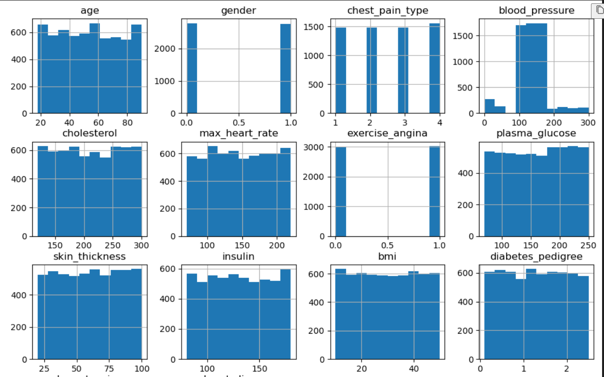
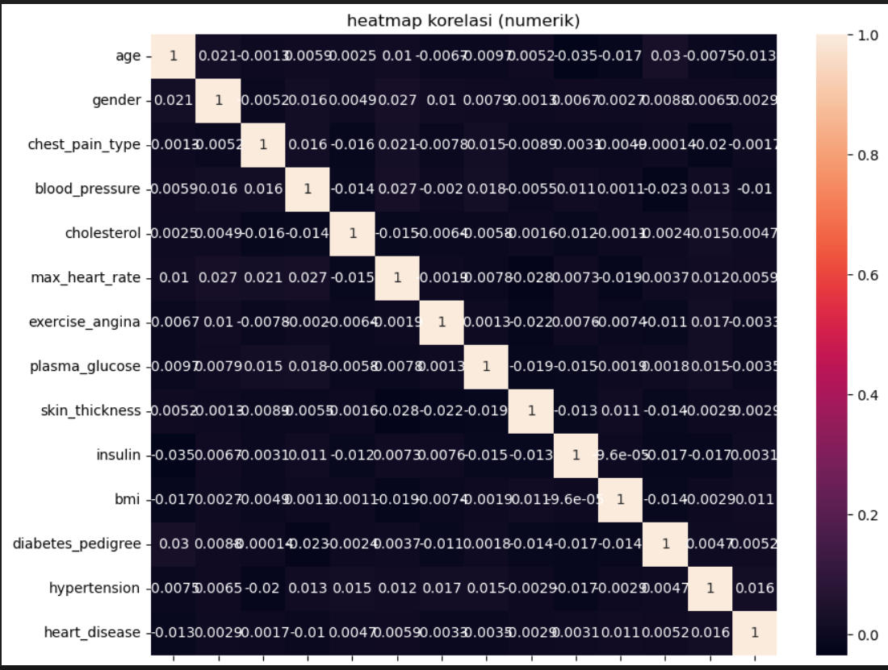
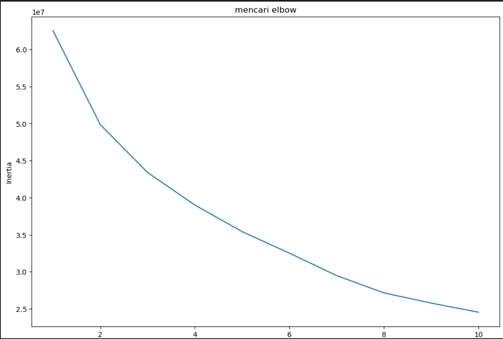
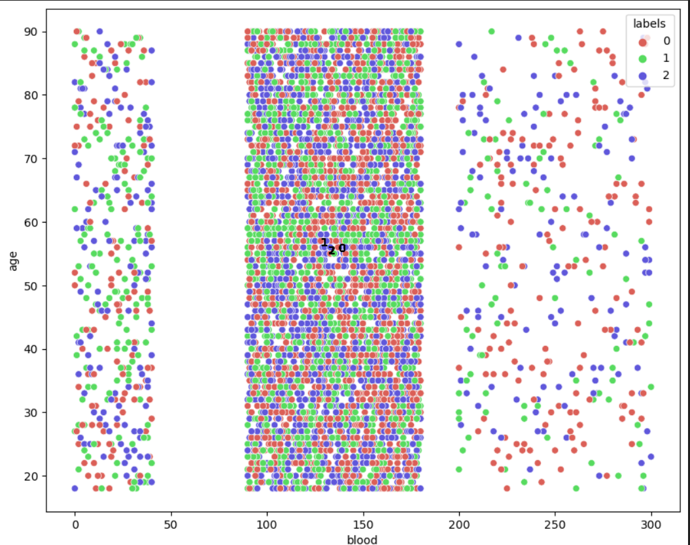

# Laporan Proyek Machine Learning
### Nama : Ferina Melania Sari
### NIM : 211351056
### Kelas : Informatika Malam A

## Domain Proyek

Proyek ini bertujuan mengamati pasien yang membutuhkan resusitasi segera untuk memprioritaskan perawatan mereka dan memulai tindakan diagnostik/terapi yang sesuai. dan digunakan untuk melakukan pengelompokan pasien dengan penyakit yang mendesak dan memiliki gejala tersendiri untuk mengetahui gejala apa yang paling parah pada setiap penyakit.

## Business Understanding

Proyek analisis data pasien ini bertujuan untuk memberikan wawasan mendalam tentang pemilahan orang yang terluka atau sakit berdasarkan kebutuhan medis darurat dan membutuhkan Perhatian lebih. metode ini yang menentukan prioritas siapa yang mendapat perawatan terlebih dahulu. 

Bagian laporan ini mencangkup:

### Problem Statements

ketidakmungkinan untuk melakukan identifikasi pasien satu persatu untuk dilakukan pemeriksaan pasien yang harus diprioritaskan dan mendapatkan perawatan terlebih dahulu.

### Goals

Mencari solusi untuk memudahkan dalam melakukan identifikasi pasien yang harus diprioritaskan dan mendapatkan perawtan terlebih dahulu.

### Solution statements

Dengan melakukan pengamatan terhadap penyakit, gejala, tingkat keparahan, prognosis pada pasien. pertama adalah mencari dataset melalui kaggle.com untuk memberikan informasi mengenai pasien yang harus diperiksa. lalu menganalisis data tersebut dengan metode algoritma kmeans untuk mencari rata-rata dan mengelompokan pasien yang harus segera ditangani.

## Data Understanding

Data yang saya gunakan berasal dari kaggleyang berisi data pasien yang terkena bencana. dataset ini merupakan sekumpulan data yang dikumpulkan dari website real pengumpulan data pasien.dataset ini mengandung 6,001 baris dan lebih dari 10 columns.

https://www.kaggle.com/datasets/arjunnsharma/patient-dataset-for-clustering-raw-data

## Variabel-variabel yang digunakan

age : mengetahui umur pasien (int64)
chestpain : mengetahui riwayat sakit dada pasien (int64)
blood : mengetahui tekanan darah pasien (int64)
cholesterol : mengetahui riwayat kolesterol pasien (int64)
maxheart : mengetahui detak jantung pasien (int64)
glucose : mengetahui glukosa plasma pasien (int64)
thickness : mengetahui ketebalan kulit (int6)
hypertension : mengetahui hipertensi pasien (int64)
heartdisease : mengetahui penyakit jantung pasien (int64)

## Data Preparation

### Data Collection

Untuk data collection ini, saya mendapatkan dataset yang nantinya digunakan dari website kaggle dengan nama dataset Patient Dataset for Clustering (Raw Data), jika anda tertarik dengan datasetnya , anda bisa click link diatas.

### Data Discovery And Profilling

Untuk bagian ini, kita akan menggunakan teknik EDA.
pertama kita mengimport semua library yang dibutuhkan,

```python
import streamlit as st
import pandas as pd
import numpy as np
import matplotlib.pyplot as plt
import seaborn as sns
from sklearn.cluster import KMeans
from sklearn.impute import SimpleImputer
```
setelah itu kita panggil dataset 
```python
df = pd.read_csv('patient_dataset.csv')
```

untuk melihat mengenai type data dari masing masing kolom kita bisa menggunakan properti info,
```python
df.info()
```
kita lanjut dengan data exploration kita,
```python
df.hist(figsize=(12, 10))
plt.show()
```


```python
numeric_df = df.select_dtypes(include=['int64', 'float64'])

plt.figure(figsize=(10,8))
sns.heatmap(numeric_df.corr(),annot=True)
plt.title("heatmap korelasi (numerik)")
plt.show()
```


## Preprocesing 
Disini kita akan mengubah nama columns agar lebih mudah dan tidak ribet,
```python
df.rename(index=str, columns={
    'chest_pain_type' : 'chestpain',
    'blood_pressure' : 'blood',
    'max_heart_rate' : 'maxheart',
    'plasma_glucose' : 'glucose',
    'skin_thickness' : 'thickness',
    'heart_disease' : 'heartdisease'


}, inplace=True)
```

lalu kita hapus columns yang tidak digunakan 
```python
x = df.drop(['gender', 'insulin', 'bmi', 'diabetes_pedigree', 'exercise_angina', 'residence_type', 'smoking_status'], axis=1)
```

## Modeling
kita Tentukan Jumlah Cluster Dengan Elbow

```python
clusters= []
for i in range(1, 11):
    km =KMeans(n_clusters=i).fit(x_imputed)
    clusters.append(km.inertia_)


fig, ax = plt.subplots(figsize=(12, 8))
sns.lineplot(x=list(range(1,11)), y=clusters, ax=ax)
ax.set_title('mencari elbow')
ax.set_xlabel('Clusters')
ax.set_ylabel('Inertia')

#Panah elbow
ax.annotate('possible elbow point', xy=(3, 4.5), xytext=(3, 2.5), xycoords='data',
            arrowprops=dict(arrowstyle='->', connectionstyle='arc3', color='blue', lw=2))

ax.annotate('possible elbow point', xy=(4, 4.5), xytext=(4, 2.5), xycoords='data',
            arrowprops=dict(arrowstyle='->', connectionstyle='arc3', color='blue', lw=2))
```


lalu kita lakukan proses clustering

```python
n_clust = 3
kmean = KMeans(n_clusters=n_clust).fit(x_imputed)
x['labels'] = kmean.labels_
```
```python
plt.figure(figsize=(10, 8))
sns.scatterplot(x=x['blood'], y=x['age'], hue=x['labels'], palette=sns.color_palette('hls', n_colors=n_clust))

for label in x['labels']:
    plt.annotate(label,
                 (x[x['labels'] == label]['blood'].mean(),
                  x[x['labels'] == label]['age'].mean()),
                 textcoords="offset points",
                 xytext=(0, 10),
                 ha='center')
```


## Evalution

menggunakan Silhouette Score sebagai evaluasi.

Silhouette Score adalah metrik evaluasi yang digunakan untuk mengukur seberapa baik suatu objek telah diklasifikasikan dalam klusternya dibandingkan dengan kluster lainnya. Metrik ini memberikan nilai antara -1 dan 1

Secara matematis, Silhouette Score untuk satu sampel dihitung menggunakan formula:

s=b−amax⁡(a,b)s=max(a,b)b−a​

a adalah rata-rata jarak antara suatu sampel dan semua sampel dalam kluster yang sama.
b adalah rata-rata jarak antara suatu sampel dan semua sampel dalam kluster yang berbeda, di mana bb dipilih sebagai kluster dengan jarak terdekat yang tidak mengandung sampel itu sendiri.

## Deployment
[Klik Disini] 


